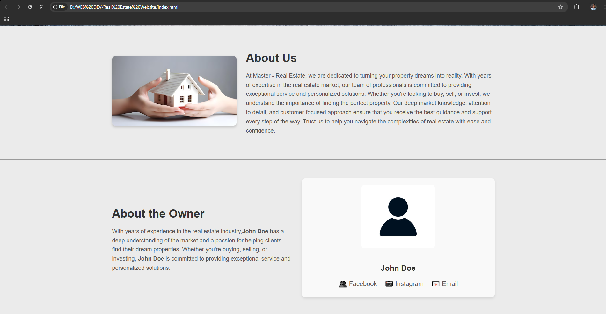
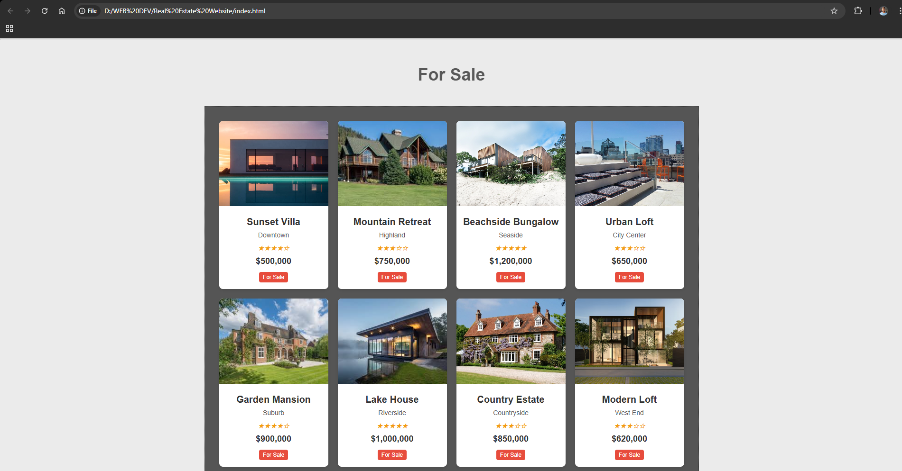
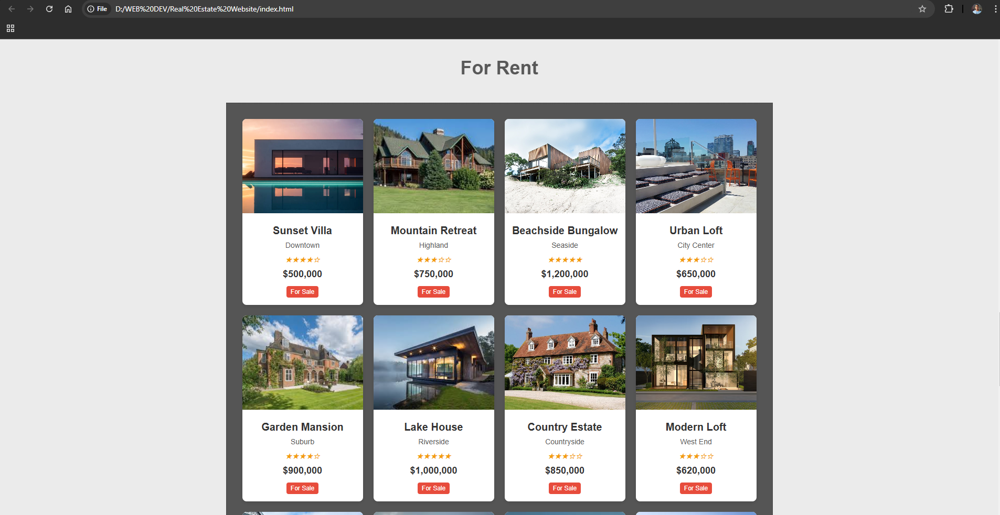
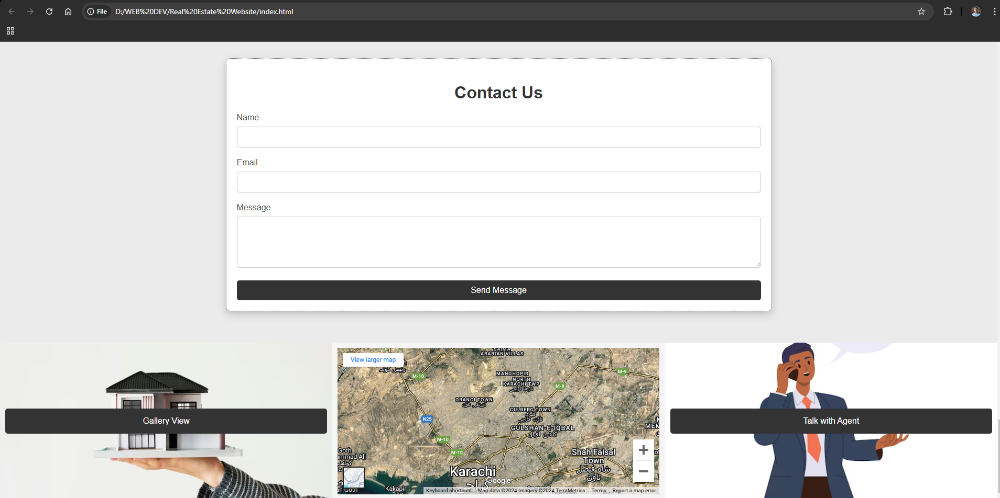
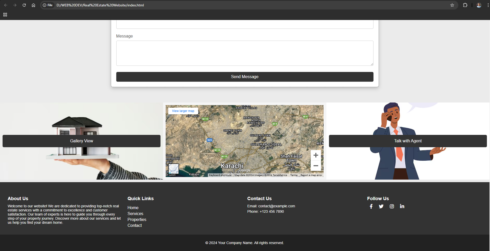

# 🏡 Master Real Estate Website

This **Estate Agency Website** showcases real estate properties with a modern, responsive design. Built using HTML, CSS, and JavaScript, it provides a seamless browsing experience across all devices.

<table>
  <tr>
    <td align="center">
      
       
    </td>
    <td align="center">
      
       
    </td>
    <td align="center">
      
       
    </td>
  </tr>
  <tr>
    <td align="center">
      
       
    </td>
    <td align="center">
      
       
    </td>
  </tr>
</table>

---

## Features

- **Property Listings**: Display of properties with details like price, location, and features.
- **Responsive Design**: Optimized for desktops, tablets, and mobile devices.
- **Search Functionality**: Easily find properties based on filters and keywords.
- **Modern UI**: Clean and professional interface.

---

## Technologies Used

- **HTML5** for structuring the website.
- **CSS3** for styling and responsive layout.
- **JavaScript (ES6)** for interactive elements and functionality.

---

